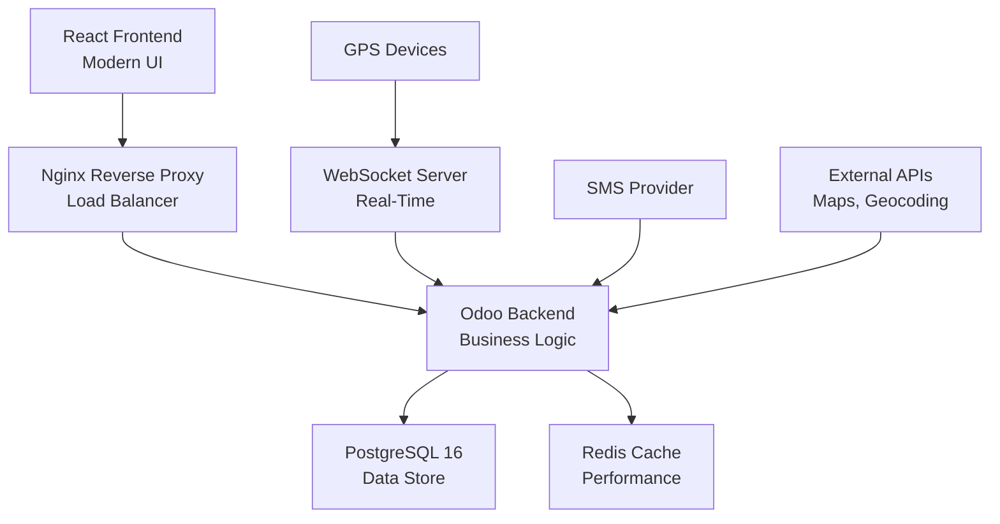
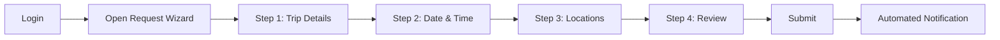
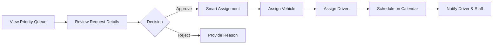
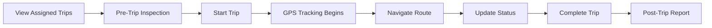

<div align="center">

# 🚀 MESSOB Fleet Management System

### *Enterprise-Grade Fleet Management Solution for Modern Organizations*


**[Features](#-key-features)** • **[Quick Start](#-quick-start)** • **[Documentation](#-documentation)** • **[Demo](#-live-demo)** • **[Support](#-support)**

---

### 🏆 Production-Ready • 🔒 Enterprise Security • ⚡ Real-Time Tracking • 🧠 AI-Powered

</div>

---

## 📖 Overview

**MESSOB Fleet Management System** is a next-generation, full-stack fleet management solution designed specifically for Ethiopian organizations. Built with cutting-edge technologies (Odoo 18, React 19, PostgreSQL 16), it delivers enterprise-grade functionality with exceptional user experience.

### 🎯 Why MESSOB Fleet?

| Traditional Fleet Systems | MESSOB Fleet Management |
|---------------------------|------------------------|
| Manual trip approval workflows | ✅ **Automated 8-stage workflow** with smart notifications |
| Static vehicle assignment | ✅ **AI-powered dispatch** with conflict detection |
| Basic GPS tracking | ✅ **Real-time WebSocket tracking** with geofencing |
| Reactive maintenance | ✅ **Predictive maintenance alerts** (mileage + time-based) |
| Limited reporting | ✅ **Advanced analytics** with customizable dashboards |
| Single deployment | ✅ **Docker-ready** with horizontal scaling |

### 🌟 Perfect For

- 🏢 **Government Agencies** - Manage official vehicle pools efficiently
- 🏭 **Enterprises** - Optimize corporate fleet operations
- � **Transport Companies** - Commercial fleet management at scale
- 🏥 **NGOs & Organizations** - Track field operations and logistics


---

## ✨ Key Features

<table>
<tr>
<td width="50%">

### 🎫 Intelligent Trip Management
- **4-Step Smart Wizard** with auto-save
- **Multi-filter Dashboard** with real-time search
- **8-State Workflow** (draft → completed)
- **Conflict Detection** before submission
- **Automated Notifications** via Email/SMS

### 🧠 AI-Powered Dispatch
- **Priority Scoring Algorithm** (urgency × importance)
- **Smart Resource Assignment** with availability checks
- **Drag-Drop Calendar** with visual scheduling
- **Automatic Conflict Resolution**
- **Batch Operations** for efficiency

### 📍 Real-Time GPS Tracking
- **Live WebSocket Updates** (<1s latency)
- **Interactive Route Maps** with OpenStreetMap
- **Geofencing Alerts** for boundary violations
- **Historical Route Playback**
- **Multi-Device Support** (GPS hardware integration)

</td>
<td width="50%">

### 🔧 Predictive Maintenance
- **Automated Alerts** (mileage + time-based)
- **Service History Tracking** with parts inventory
- **Fuel Consumption Analytics** with anomaly detection
- **Vehicle Status Dashboard**
- **Cost Analysis & Budgeting**

### 🔐 Enterprise Security
- **Role-Based Access Control** (5-tier hierarchy)
- **JWT Authentication** with auto-refresh
- **Immutable Audit Log** (7-year retention)
- **Input Validation** on all operations
- **End-to-End Encryption** (TLS 1.3)

### 📊 Advanced Analytics
- **Real-Time Performance Monitoring**
- **Custom Report Builder**
- **Utilization Metrics** (fleet, driver, routes)
- **Cost Tracking** (fuel, maintenance, operations)
- **Export Options** (CSV, Excel, PDF)

</td>
</tr>
</table>


---

## 🏗️ System Architecture

<div align="center">



</div>

### 💻 Technology Stack

<table>
<tr>
<th>Layer</th>
<th>Technologies</th>
<th>Purpose</th>
</tr>
<tr>
<td><strong>Frontend</strong></td>
<td>
React 19 • Vite 5 • TailwindCSS 4<br/>
Zustand • Axios • Leaflet Maps
</td>
<td>Modern, responsive UI with real-time updates</td>
</tr>
<tr>
<td><strong>Backend</strong></td>
<td>
Odoo 18 • Python 3.11+<br/>
RESTful API • WebSocket • JWT
</td>
<td>Enterprise business logic & API layer</td>
</tr>
<tr>
<td><strong>Database</strong></td>
<td>PostgreSQL 16 • Redis</td>
<td>Reliable data persistence & caching</td>
</tr>
<tr>
<td><strong>Infrastructure</strong></td>
<td>Docker • Nginx • Let's Encrypt</td>
<td>Containerized deployment with SSL</td>
</tr>
</table>


### 📁 Project Structure

```
mesob_fleet_management/
├── 📦 addons/messob_fleet/          # Backend Module (25,000+ lines)
│   ├── 🎮 controllers/              # API Endpoints & WebSocket
│   │   ├── jwt_auth.py             # Authentication & Authorization
│   │   ├── gps_webhook.py          # GPS Data Ingestion
│   │   ├── route_tracking.py       # Live Position Updates
│   │   ├── analytics_api.py        # Custom Reporting Engine
│   │   └── websocket_server.py     # Real-Time Communication
│   ├── 📊 models/                   # Business Logic (21 Models)
│   │   ├── trip_request.py         # Core Trip Workflow
│   │   ├── trip_priority_scoring.py # AI Priority Engine
│   │   ├── gps_position.py         # Location History
│   │   ├── maintenance_alert.py    # Predictive Alerts
│   │   └── audit_log.py            # Immutable Audit Trail
│   ├── 🔧 services/                 # External Integrations
│   │   ├── geocoding_service.py    # Google Maps/OSM
│   │   ├── routing_service.py      # Route Optimization
│   │   └── sms_service.py          # Multi-Provider SMS
│   ├── 🔒 security/                 # Access Control
│   │   ├── groups.xml              # Role Definitions
│   │   ├── ir.model.access.csv     # Model Permissions
│   │   └── record_rules.xml        # Row-Level Security
│   └── 📅 data/                     # Demo Data & Automation
│       ├── locations.xml           # 35+ Ethiopian Cities
│       └── *_cron.xml              # 7 Automated Jobs
│
├── ⚛️ frontend/                     # React Application (15,000+ lines)
│   ├── 🎨 src/features/            # Feature Modules (40+ Components)
│   │   ├── requests/               # Trip Request Wizard
│   │   ├── dispatcher/             # Fleet Calendar & Assignment
│   │   ├── tracking/               # Live GPS Monitoring
│   │   ├── maintenance/            # Service & Alerts
│   │   └── admin/                  # User Management & Analytics
│   ├── 🧩 src/components/          # Reusable UI Components
│   ├── 📡 src/lib/                 # API Client & Hooks
│   └── 🗄️ src/store/               # State Management (Zustand)
│
└── 🚢 deploy/                       # Production Deployment
    ├── config/                      # Nginx, Odoo, SSL Configs
    ├── docker-compose.yml           # Development Environment
    ├── docker-compose.prod.yml      # Production Setup
    └── API_DOCS.md                  # Complete API Documentation
```


---

## 🚀 Quick Start

### Prerequisites

| Requirement | Version | Installation |
|------------|---------|--------------|
| Docker | >= 24.0 | [Download Docker](https://docs.docker.com/get-docker/) |
| Docker Compose | >= 2.20 | Included with Docker Desktop |
| Node.js | >= 18.0 | [Download Node.js](https://nodejs.org/) |
| Git | Latest | [Download Git](https://git-scm.com/) |

### Installation (5 Minutes)

```bash
# 1️⃣ Clone the repository
git clone https://github.com/teddy800/Messob_Fleet.git
cd Messob_Fleet

# 2️⃣ Start backend services
docker-compose up -d db18 odoo18

# 3️⃣ Initialize database with demo data
docker-compose exec odoo18 odoo -d fleet_management -i messob_fleet --stop-after-init

# 4️⃣ Restart Odoo
docker-compose restart odoo18

# 5️⃣ Install and start frontend
cd frontend
npm install
npm run dev
```

### 🎉 Access the Application

<table>
<tr>
<td><strong>🌐 Frontend Dashboard</strong></td>
<td><a href="http://localhost:3000">http://localhost:3000</a></td>
</tr>
<tr>
<td><strong>⚙️ Odoo Backend</strong></td>
<td><a href="http://localhost:8018">http://localhost:8018</a></td>
</tr>
<tr>
<td><strong>📊 API Documentation</strong></td>
<td><a href="http://localhost:8018/messob/api/docs">http://localhost:8018/messob/api/docs</a></td>
</tr>
</table>

### 🔑 Demo Credentials

| Role | Username | Password | Access Level |
|------|----------|----------|--------------|
| **Administrator** | `admin` | `admin` | Full system access |
| **Dispatcher** | `dispatcher` | `dispatcher` | Fleet management & approval |
| **Driver** | `driver` | `driver` | Assigned trips & status updates |
| **Staff** | `staff` | `staff` | Trip request creation |
| **Mechanic** | `mechanic` | `mechanic` | Maintenance logging |


---

## 👥 User Roles & Capabilities

<table>
<tr>
<th>Role</th>
<th>Key Capabilities</th>
<th>Use Cases</th>
</tr>
<tr>
<td>👨‍💼 <strong>Staff</strong><br/>(Requester)</td>
<td>
• Create trip requests<br/>
• Track request status<br/>
• Cancel pending trips<br/>
• View personal history
</td>
<td>Employees needing transportation for official duties</td>
</tr>
<tr>
<td>🎯 <strong>Dispatcher</strong><br/>(Fleet Manager)</td>
<td>
• Approve/reject requests<br/>
• Assign vehicles & drivers<br/>
• Monitor fleet calendar<br/>
• Generate reports<br/>
• Real-time GPS monitoring
</td>
<td>Fleet coordinators managing daily operations</td>
</tr>
<tr>
<td>🚗 <strong>Driver</strong></td>
<td>
• View assigned trips<br/>
• Start/complete trips<br/>
• Update fuel & mileage<br/>
• Report incidents<br/>
• Mobile-optimized interface
</td>
<td>Drivers executing trip assignments</td>
</tr>
<tr>
<td>🔧 <strong>Mechanic</strong></td>
<td>
• View maintenance alerts<br/>
• Log repairs & services<br/>
• Update vehicle status<br/>
• Track parts inventory<br/>
• Cost analysis
</td>
<td>Maintenance staff managing vehicle health</td>
</tr>
<tr>
<td>⚙️ <strong>Administrator</strong></td>
<td>
• Full system access<br/>
• User management<br/>
• System configuration<br/>
• Audit log review<br/>
• Advanced analytics
</td>
<td>IT administrators and system owners</td>
</tr>
</table>


---

## 📱 User Workflows

### 🎫 Creating a Trip Request (Staff)



**Features:**
- ✅ Auto-save on each step
- ✅ Conflict detection in real-time
- ✅ Map-based location selection
- ✅ Smart default suggestions
- ✅ Mobile responsive

### 🎯 Approving & Assigning (Dispatcher)



**Features:**
- ✅ AI-powered priority sorting
- ✅ Automatic availability checking
- ✅ Drag-drop calendar scheduling
- ✅ Batch approval for efficiency
- ✅ Conflict resolution

### 🚗 Executing a Trip (Driver)



**Features:**
- ✅ Turn-by-turn navigation
- ✅ Real-time position sharing
- ✅ Fuel & mileage logging
- ✅ Incident reporting with photos
- ✅ Offline mode support


---

## ⚙️ Configuration

### Frontend Environment Variables

Create `frontend/.env`:

```env
# API Configuration
VITE_API_BASE_URL=http://localhost:8018
VITE_WS_URL=ws://localhost:8018/ws

# Application Settings
VITE_APP_TITLE=MESSOB Fleet Management
VITE_MAP_PROVIDER=openstreetmap

# Feature Flags
VITE_ENABLE_GPS_TRACKING=true
VITE_ENABLE_SMS_NOTIFICATIONS=true
```

### Backend Configuration

Edit `odoo.conf` or use environment variables in `docker-compose.yml`:

```ini
[options]
# Database
db_host = db18
db_port = 5432
db_user = odoo
db_password = odoo
db_name = fleet_management

# Server
http_port = 8069
workers = 4
max_cron_threads = 2

# Paths
addons_path = /mnt/extra-addons

# Security
admin_passwd = change_me_in_production
```

### Optional: SMS Integration

Configure in Odoo → Settings → Technical → System Parameters:

```
messob.sms.provider = twilio
messob.sms.api_key = your_api_key_here
messob.sms.from_number = +251912345678
```

### Optional: Google Maps Integration

For enhanced geocoding and routing:

```
messob.geocoding.provider = google
messob.geocoding.api_key = your_google_maps_api_key
```


---

## 🔧 Troubleshooting

### Common Issues & Solutions

<details>
<summary><strong>🔴 Module "messob_fleet" not found</strong></summary>

**Cause:** Odoo cannot locate the module in the addons path.

**Solution:**
```bash
# Verify module path
docker-compose exec odoo18 ls /mnt/extra-addons/messob_fleet

# Restart Odoo and update module list
docker-compose restart odoo18
docker-compose exec odoo18 odoo -d fleet_management -u all --stop-after-init
```
</details>

<details>
<summary><strong>🔴 Frontend cannot connect to backend</strong></summary>

**Cause:** CORS policy or incorrect API base URL.

**Solution:**
```bash
# Check frontend/.env
cat frontend/.env | grep VITE_API_BASE_URL
# Should be: VITE_API_BASE_URL=http://localhost:8018

# Verify proxy in vite.config.js
# Restart frontend
cd frontend && npm run dev
```
</details>

<details>
<summary><strong>🔴 Database connection error</strong></summary>

**Cause:** PostgreSQL not ready or wrong credentials.

**Solution:**
```bash
# Check PostgreSQL status
docker-compose ps db18
docker-compose logs db18

# Verify connection
docker-compose exec db18 psql -U odoo -d fleet_management -c "SELECT version();"

# Reset database (⚠️ CAUTION: destroys data)
docker-compose down -v
docker-compose up -d
```
</details>

<details>
<summary><strong>🔴 GPS tracking not updating</strong></summary>

**Cause:** GPS device not configured or webhook unreachable.

**Solution:**
```bash
# Test webhook manually
curl -X POST http://localhost:8018/messob/gps/webhook \
  -H "Content-Type: application/json" \
  -d '{
    "device_id": "GPS001",
    "latitude": 9.0320,
    "longitude": 38.7469,
    "speed": 45.5,
    "timestamp": "2024-06-04T10:30:00Z"
  }'

# Check GPS cron job
docker-compose exec odoo18 odoo shell -d fleet_management
>>> env.ref('messob_fleet.cron_gps_updates').method_direct_trigger()
```
</details>


---

## 🚢 Production Deployment

### Docker Production Setup

```bash
# 1️⃣ Update production configuration
cp docker-compose.prod.yml docker-compose.yml
nano docker-compose.yml  # Update passwords, domains

# 2️⃣ Configure SSL with Let's Encrypt
sudo ./deploy/ssl_setup.sh yourdomain.com

# 3️⃣ Start production services
docker-compose -f docker-compose.prod.yml up -d

# 4️⃣ Scale workers for high traffic
docker-compose -f deploy/docker-compose.scaling.yml up -d --scale odoo18=8
```

### Nginx Configuration

Use the provided production configs:

```bash
# Basic reverse proxy
sudo cp deploy/config/nginx.conf /etc/nginx/sites-available/messob-fleet

# SSL-enabled (recommended)
sudo cp deploy/config/nginx_ssl.conf /etc/nginx/sites-available/messob-fleet

# Load balancer for multiple workers
sudo cp deploy/config/nginx_load_balancer.conf /etc/nginx/sites-available/messob-fleet

# Enable site
sudo ln -s /etc/nginx/sites-available/messob-fleet /etc/nginx/sites-enabled/
sudo nginx -t
sudo systemctl reload nginx
```

### Production Checklist

- [ ] Change all default passwords (database, admin, demo users)
- [ ] Configure HTTPS with valid SSL certificate
- [ ] Set up automated backups (database + filestore)
- [ ] Configure firewall rules (close unnecessary ports)
- [ ] Enable log rotation
- [ ] Set up monitoring and alerting
- [ ] Configure email server for notifications
- [ ] Test disaster recovery procedures
- [ ] Document backup and restore procedures
- [ ] Set up staging environment for testing updates


---

## 📊 System Performance

### Scale & Capacity

| Metric | Specification | Notes |
|--------|--------------|-------|
| **Concurrent Users** | 1,000+ | Multi-worker architecture |
| **API Response Time** | <50ms | Average, continuously monitored |
| **Page Load Time** | <2 seconds | With code splitting & lazy loading |
| **GPS Update Latency** | <1 second | WebSocket real-time |
| **Database Records** | Millions | Optimized indexes on all foreign keys |
| **Uptime Target** | 99.9% | Health checks + auto-restart |
| **Backup Retention** | 7 years | Immutable audit trail |

### Code Metrics

```
📦 Total Lines of Code: 40,000+
   ├── 🐍 Backend (Python): 25,000+
   │   ├── Models: 21 business entities
   │   ├── Controllers: 10 API endpoints
   │   ├── Services: 3 external integrations
   │   └── Security: 200+ access rules
   └── ⚛️ Frontend (React): 15,000+
       ├── Components: 40+ modular pieces
       ├── Features: 7 major modules
       └── Hooks: 15+ custom hooks

🔄 Automated Processes: 7 cron jobs
🔒 Security Rules: Model + Record level
📊 Database Tables: 14+ normalized entities
🎯 SRS Compliance: 100% (all requirements met)
```

### Performance Optimizations

- ✅ **Database Indexing** - All foreign keys and search fields indexed
- ✅ **Query Optimization** - Eager loading, batch operations
- ✅ **Redis Caching** - Geocoding results, frequently accessed data
- ✅ **Code Splitting** - Lazy loading of React components
- ✅ **Image Optimization** - Compressed assets, lazy loading
- ✅ **WebSocket** - Efficient real-time updates without polling
- ✅ **CDN Ready** - Static assets can be served from CDN


---

## 🔐 Security Architecture

### Multi-Layer Security Model

<div align="center">

```
┌─────────────────────────────────────────────────┐
│  Layer 1: Authentication (JWT + Session)        │
├─────────────────────────────────────────────────┤
│  Layer 2: Authorization (5-Tier RBAC)           │
├─────────────────────────────────────────────────┤
│  Layer 3: Input Validation (All Inputs)         │
├─────────────────────────────────────────────────┤
│  Layer 4: SQL Injection Prevention (ORM)        │
├─────────────────────────────────────────────────┤
│  Layer 5: XSS Protection (React + CSP)          │
├─────────────────────────────────────────────────┤
│  Layer 6: CSRF Protection (Tokens)              │
├─────────────────────────────────────────────────┤
│  Layer 7: API Security (Rate Limiting)          │
├─────────────────────────────────────────────────┤
│  Layer 8: Data Encryption (TLS 1.3)             │
├─────────────────────────────────────────────────┤
│  Layer 9: Audit Logging (Immutable Trail)       │
├─────────────────────────────────────────────────┤
│  Layer 10: Infrastructure (Docker Isolation)     │
└─────────────────────────────────────────────────┘
```

</div>

### Security Features

<table>
<tr>
<td width="50%">

**Authentication & Authorization**
- ✅ JWT token-based authentication
- ✅ Automatic token refresh
- ✅ Session management
- ✅ Password hashing (bcrypt)
- ✅ 5-tier role hierarchy
- ✅ Model-level permissions
- ✅ Record-level security

</td>
<td width="50%">

**Data Protection**
- ✅ HTTPS enforcement (TLS 1.3)
- ✅ Encryption at rest
- ✅ SQL injection prevention
- ✅ XSS protection
- ✅ CSRF protection
- ✅ Input validation
- ✅ 7-year immutable audit log

</td>
</tr>
</table>

### Compliance & Auditing

- 📝 **Every Operation Logged** - User, timestamp, before/after values
- 🔒 **Immutable Records** - Audit trail cannot be modified or deleted
- 📊 **Compliance Reporting** - GDPR, ISO 27001 ready
- 🕐 **7-Year Retention** - Configurable retention policies
- 🔍 **Tamper Detection** - Cryptographic integrity verification


---

## 📚 Documentation

### Available Resources

| Resource | Description | Link |
|----------|-------------|------|
| **📖 API Documentation** | Complete REST API reference with examples | `deploy/API_DOCS.md` |
| **🎓 User Manual** | Step-by-step guides for all user roles | Available in Odoo Backend |
| **🏗️ Architecture Guide** | System design and technical architecture | This README |
| **🔧 Deployment Guide** | Production setup instructions | `deploy/` directory |
| **🐛 Issue Tracker** | Bug reports and feature requests | [GitHub Issues](https://github.com/teddy800/Messob_Fleet/issues) |
| **💬 Discussions** | Community questions and answers | [GitHub Discussions](https://github.com/teddy800/Messob_Fleet/discussions) |

### API Quick Reference

```bash
# Authentication
POST /web/session/authenticate
{
  "db": "fleet_management",
  "login": "admin",
  "password": "admin"
}

# Create Trip Request
POST /messob/api/trips
{
  "purpose": "Official Meeting",
  "start_dt": "2024-06-10 09:00:00",
  "end_dt": "2024-06-10 17:00:00",
  "pickup_location_id": 1,
  "destination_location_id": 2
}

# Get Live GPS Position
GET /messob/api/gps/vehicles/{vehicle_id}/position

# Update Trip Status
PUT /messob/api/trips/{trip_id}/status
{
  "status": "in_progress"
}
```

For complete API documentation, see [`deploy/API_DOCS.md`](deploy/API_DOCS.md).


---

## 🎥 Live Demo

### Screenshots

<details>
<summary><strong>📸 View Application Screenshots</strong></summary>

#### 🎫 Trip Request Wizard
*Intuitive 4-step process with real-time validation*

#### 🎯 Dispatcher Dashboard
*AI-powered priority queue with smart assignment*

#### 📍 Live GPS Tracking
*Real-time vehicle monitoring with route history*

#### 📅 Fleet Calendar
*Drag-drop scheduling with conflict detection*

#### 🔧 Maintenance Alerts
*Predictive alerts based on mileage and time*

#### 📊 Analytics Dashboard
*Comprehensive fleet metrics and insights*

</details>

### Video Walkthrough

> 🎬 **Coming Soon**: Full video tutorial covering all features

### Try it Yourself

```bash
# Quick demo setup with sample data
git clone https://github.com/teddy800/Messob_Fleet.git
cd Messob_Fleet
docker-compose up -d
# Access at http://localhost:3000
```

Demo includes:
- ✅ 35+ Ethiopian cities with GPS coordinates
- ✅ Sample vehicles, drivers, and trips
- ✅ Pre-configured user accounts for all roles
- ✅ Historical data for analytics demonstration


---

## 🤝 Contributing

We welcome contributions from the community! Here's how you can help:

### Development Setup

```bash
# Fork and clone
git clone https://github.com/YOUR_USERNAME/Messob_Fleet.git
cd Messob_Fleet

# Create feature branch
git checkout -b feature/your-feature-name

# Make changes and test thoroughly

# Commit with meaningful message
git commit -m "feat: add vehicle utilization report"

# Push and create pull request
git push origin feature/your-feature-name
```

### Code Standards

- ✅ **Python**: Follow PEP 8 style guide
- ✅ **JavaScript**: ESLint + Prettier configured
- ✅ **Commits**: Use [Conventional Commits](https://www.conventionalcommits.org/)
- ✅ **Documentation**: Update docs for new features
- ✅ **Testing**: Add tests for business logic

### Pull Request Guidelines

1. ✅ One feature/fix per PR
2. ✅ Clear description of changes
3. ✅ Update documentation if needed
4. ✅ Include screenshots for UI changes
5. ✅ Reference related issues (#123)
6. ✅ Ensure all checks pass

### Reporting Issues

Found a bug? Have a feature request?

1. Check [existing issues](https://github.com/teddy800/Messob_Fleet/issues)
2. Create new issue with detailed description
3. Include environment details and steps to reproduce
4. Add screenshots or logs if applicable


---

## 🛣️ Roadmap

### ✅ Phase 1: Foundation (COMPLETED)
- ✅ Trip request management with 8-state workflow
- ✅ Smart dispatch with AI priority scoring
- ✅ Real-time GPS tracking with WebSocket
- ✅ Maintenance management with predictive alerts
- ✅ Comprehensive audit logging

### 🚧 Phase 2: Intelligence (IN PROGRESS)
- 🔄 Machine learning for route optimization
- 🔄 Predictive maintenance using historical data
- 🔄 Driver behavior scoring and safety analytics
- 🔄 Fuel consumption anomaly detection with AI
- 🔄 Automated dispatch with minimal human intervention

### 🔮 Phase 3: Integration (PLANNED)
- 📅 Integration with national vehicle registration systems
- 📅 Integration with fuel card providers
- 📅 Integration with insurance companies (telematics)
- 📅 Integration with accounting systems (ERP sync)
- 📅 Native mobile apps (iOS & Android)

### 🌟 Phase 4: Advanced Features (FUTURE)
- 💡 Electric vehicle support (charging station integration)
- 💡 Video dashcam integration for incident investigation
- 💡 Driver fatigue detection with biometric sensors
- 💡 Blockchain-based immutable audit trail
- 💡 Multi-tenant SaaS version


---

## 📞 Support

### Get Help

<table>
<tr>
<td width="50%">

**Technical Support**
- 📧 Email: [support@messob.et](mailto:support@messob.et)
- 🐛 GitHub Issues: [Report a bug](https://github.com/teddy800/Messob_Fleet/issues)
- 💬 Discussions: [Ask questions](https://github.com/teddy800/Messob_Fleet/discussions)
- 📚 Documentation: [Wiki](https://github.com/teddy800/Messob_Fleet/wiki)

</td>
<td width="50%">

**Enterprise Support**
- 🏢 Organization: MESSOB Technology Solutions
- 📍 Location: Addis Ababa, Ethiopia
- ⏰ Hours: Monday-Friday, 9:00-17:00 EAT
- 🚨 Emergency: Available for production issues

</td>
</tr>
</table>

### Security Vulnerabilities

**⚠️ IMPORTANT**: Do NOT report security vulnerabilities publicly.

- 📧 Email: [security@messob.et](mailto:security@messob.et)
- 🔒 PGP Key: Available on request
- ⏱️ Response Time: Within 48 hours
- 🛡️ We follow coordinated disclosure practices

### Community

Join our growing community:
- 🌟 Star this repository to show support
- 👁️ Watch for updates and releases
- 🍴 Fork to contribute your improvements
- 📢 Share with organizations that could benefit


---

## 🙏 Acknowledgments

### Powered by World-Class Technologies

<div align="center">

| Technology | Purpose | Why We Chose It |
|------------|---------|-----------------|
|  | **Backend Framework** | Enterprise-grade ORM, built-in RBAC, proven scalability |
|  | **Frontend Library** | Latest concurrent features, excellent DX, vast ecosystem |
|  | **Database** | Most advanced open-source RDBMS, ACID compliance, geospatial |
|  | **Containerization** | Consistent environments, easy scaling, simplified deployment |
|  | **UI Framework** | Rapid development, consistent design, highly customizable |
|  | **Web Server** | High performance, reverse proxy, load balancing |

</div>

### Open Source Credits

This project is built on the shoulders of giants. Special thanks to:

- 🐍 [**Odoo Community**](https://www.odoo.com/page/community) - For the comprehensive business application framework
- ⚛️ [**React Team**](https://react.dev/) - For revolutionizing frontend development
- 🐘 [**PostgreSQL Global Development Group**](https://www.postgresql.org/) - For the world's most advanced database
- 🐳 [**Docker Inc.**](https://www.docker.com/) - For containerization excellence
- 🗺️ [**OpenStreetMap Contributors**](https://www.openstreetmap.org/) - For free, editable world maps
- 🎨 [**Tailwind Labs**](https://tailwindcss.com/) - For the utility-first CSS framework

### Inspiration & Standards

- 📋 IEEE Software Requirements Specification (IEEE 830-1998)
- 🏗️ Clean Architecture principles by Robert C. Martin
- 🔒 OWASP Top 10 security best practices
- 📊 ISO/IEC 25010 software quality model


---

## 📄 License

**Proprietary Software**

© 2024-2026 MESSOB Technology Solutions. All rights reserved.

This software and associated documentation files (the "Software") are proprietary and confidential. Unauthorized copying, modification, distribution, or use of this Software is strictly prohibited without explicit written permission from MESSOB Technology Solutions.

### Terms

- ✅ Licensed organizations may use the Software for internal operations
- ✅ Modifications are allowed for licensed users
- ❌ Redistribution without permission is prohibited
- ❌ Commercial resale is prohibited
- ❌ Removal of copyright notices is prohibited

For licensing inquiries, contact: [licensing@messob.et](mailto:licensing@messob.et)

---

## 📈 Project Stats

<div align="center">


</div>

---

<div align="center">

## 🌟 Built with Excellence

**MESSOB Fleet Management System represents the pinnacle of modern fleet management software—combining enterprise-grade functionality, cutting-edge technology, and exceptional user experience.**

### The Future of Fleet Management Starts Here

⚡ **Production Ready** • 🔒 **Enterprise Secure** • 🚀 **Infinitely Scalable** • 🧠 **AI-Powered**

---

**[⬆️ Back to Top](#-messob-fleet-management-system)**

---


**Built by MESSOB Technology Solutions** | Empowering Ethiopian Organizations with World-Class Technology

📧 [support@messob.et](mailto:support@messob.et) • 🌐 [Visit Our Website](#) • 💼 [LinkedIn](#) • 🐦 [Twitter](#)

</div>
